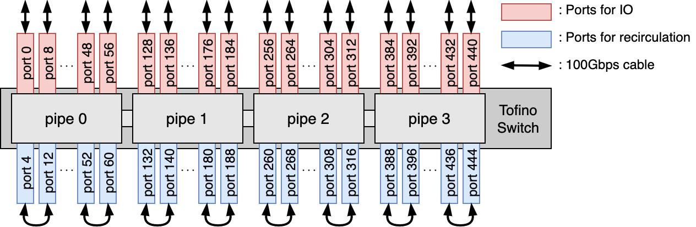

# PHI anonymity protocol on Tofino switch

This is a P4 implementation of an anonymity router for the PHI protocol [2] on Intel Tofino programmable switch. For more details, please refer to our paper: "Feasibility of Network-layer Anonymity Protocols at Terabit Speeds using a Programmable Switch," (to appear in IEEE NetSoft 22).

The part of this program calculating HalfSipHash is created with reference to [the implementation of Yoo et al.](https://github.com/Princeton-Cabernet/p4-projects/tree/master/SipHash-tofino) [3]

## Running on tofino_model
### building
- `$ cd $SDE/pkgsrc/p4-build`
- `$ ./configure --with-tofino --prefix=$SDE_INSTALL P4_VERSION=p4-16 P4_NAME=phi P4_PATH=phi_4pipes.p4`
- `$ sudo make`
- `$ sudo make install`

### running
- `$ sudo `
- `$ sudo env "PATH=$PATH" tofino-model [ -f ports.json ]`
- `$ $SDE/run_switchd.sh -p phi`
- `$ sudo python controlplane.py $SDE`
- run `demo.ipynb` with [Jupyter Notebook](https://github.com/jupyter/notebook)

## Topology with real switch

## Contributors
- Yutaro Yoshinaka (@io-sink) (Graduate School of Information Science and Technology, Osaka University)
- Junji Takemasa (@j-takemasa) (Graduate School of Information Science and Technology, Osaka University)
- Yuki Koizumi (@yuki-koizumi) (Graduate School of Information Science and Technology, Osaka University)
- Toru Hasegawa (Graduate School of Information Science and Technology, Osaka University)

## License
This program is released under the [GNU Affero General Public License v3](https://www.gnu.org/licenses/agpl-3.0.html).

## Reference
1. Y. Yoshinaka, J. Takemasa, Y. Koizumi, and T. Hasegawa, “Feasibility of Network-layer Anonymity Protocols at Terabit Speeds using a Programmable Switch,” to appear in Proceedings of IEEE International Conference on Network Softwarization 2022 (NetSoft 22), 2022. 
2. C. Chen and A. Perrig, “PHI: Path-hidden lightweight anonymity protocol at network layer,” Proceedings on Privacy Enhancing Technologies, vol. 2017, no. 1, pp. 100–117, 2016. 
3. S. Yoo and X. Chen, “Secure keyed hashing on programmable switches,” Proceedings of the ACM SIGCOMM 2021 Workshop on Secure Programmable network INfrastructure, 2021. 
